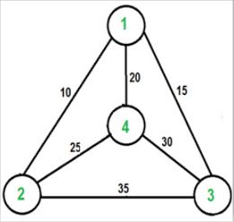

# Python - Dynamic TSP - Travel Salesman Problem

## This program uses dynamic programing to solve TSP problem finding the best path and lowest cost

  
 ### STEP 1.
* Setup working environment, Header Notes/README.
I used Visual Studio Code and Python as my working environnment for this project. I then created a README file in my github account to display
and showcase my steps during the project. 

### STEP 2.
* Started by implementing the graph representation for the four nodes with its according vertex and edges

### STEP 3.
* Imported maxsize and premutation libraries to leverage iteration and maxsize functions

### STEP 4.
* Travel Salesman Problem TSP function was created where all verteces are stored and iteration process takes effect to find the shortest path and also to record each of the nodes it has to travers to find the best path. It does it making sure every node is travel by at least once.

### Result
* The result is a print to the end user where the best path and the lowest cost is displayed. The user can change the value of variable s to see what the different result will be from each of the nodes available in the graph. It can be 0,1,2,3.
